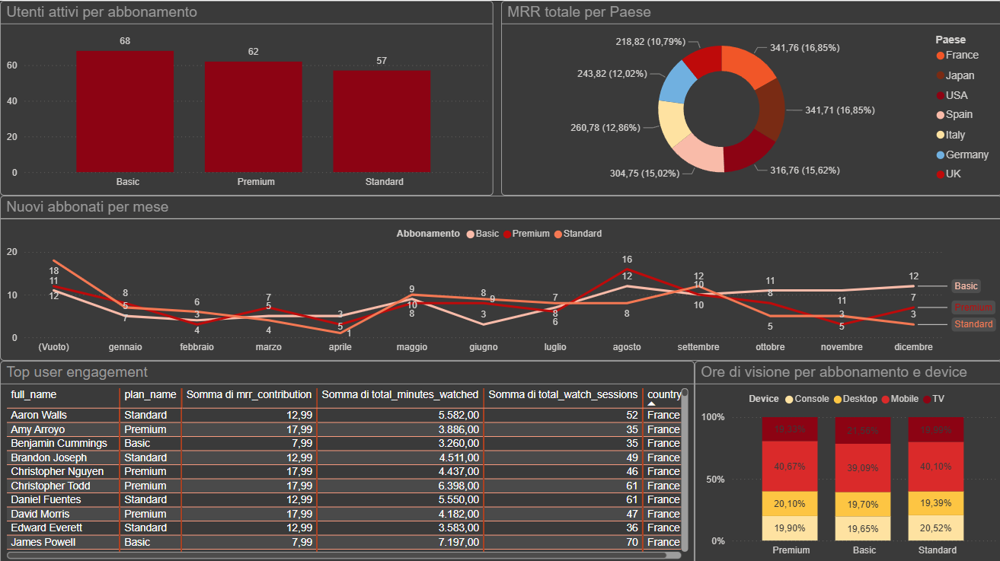

CineData ANALYSIS PIPELINE

Executive Overview:

This repository presents an end-to-end data pipeline built for a fictional streaming video-on-demand (SVOD) platform called CineData. It uses Python to construct, manage, and populate a MySQL relational database, and Microsoft Power BI for advanced data modelling, visualisation, and dashboarding. This project demonstrates skills in synthetic data generation, ETL (Extract, Transform, Load) processes, relational database design, data quality auditing, and business intelligence reporting.
The dashboard is split into 4 distinct areas: Executive Overview, Content & Engagement, User Sentiment, and Retention & Subscription Plan.

Project Structure:
- creazione_data.py: initialises the MySQL database and creates the foundational tables (Users, Movies, Genres, Subscriptions, Watch_History, etc.).
- popolamento_data.py: uses the Faker library to generate a realistic initial dataset (e.g., 500 movies, 300 users, and tens of thousands of watch history records).
- aggiornamento_data_ottimizzato.py: demonstrates how to safely alter the schema by introducing a new Devices table and linking it to the existing Watch_History without data loss.
- popolamento_avanzato_pro.py / popolamento_avanzato.py: implements advanced ETL steps, including the generation of a Date dimension (Dim_Calendar) for time-series analysis, generating user reviews, and running Data Quality Audits.
- fix_schema_rewievs.py: a script highlighting database maintenance and refactoring, specifically correcting column names in the reviews table to align with the advanced scripts.
- CineData_Dashboard.pbip: the Power BI project files, utilising the professional .pbip format for version control of the DAX model and dataset.

Data Architecture:
The pipeline populates a normalised relational database with the following core entities

Table Name                   Description
Users & Subscription_Plans - Customer demographics and their current subscription tiers (Basic, Standard, Premium).
Movies & Genres            - Content metadata, linked via a many-to-many relationship table (Movie_Genres).
Watch_History              - The central fact table logs every viewing session, including minutes watched, completion status, and device used.
Devices                    - Categorises viewing platforms (Mobile, Desktop, TV, Console).
Reviews                    - User feedback and ratings for movies are used for qualitative analysis.
Dim_Calendar               - A comprehensive date dimension table supporting time-intelligence calculations in Power BI.

ETL Highlights (Python):
The Python scripts leverage several best practices for data engineering:
- Synthetic Data Generation: The Faker library is used extensively to generate realistic user profiles, movie titles, and logical watch patterns.
- Bulk Operations: Uses cursor.executemany() for high-performance batch inserts, efficiently handling thousands of rows.
- Data Quality Checks: Scripts like popolamento_avanzato_pro.py include built-in audits (e.g., checking for orphaned records in watch history, validating average ratings, and confirming calendar integrity).
- Idempotent Operations: Uses techniques like INSERT IGNORE and CREATE TABLE IF NOT EXISTS to ensure scripts can be run multiple times safely.

Power BI Dashboard & Analytics:
The Power BI component translates the raw SQL data into actionable insights across four primary areas:
- Executive Overview: High-level KPIs tracking overall platform health, user growth, and active subscriptions.
- Content & Engagement: Analysis of viewing habits, popular genres, average watch times, and device usage trends.
- User Sentiment: Qualitative insights derived from the Reviews table, analysing user satisfaction and average ratings.
- Retention & Subscription Plan: Breakdowns of user distribution across subscription tiers and analysis of cancellation rates.
By saving the Power BI model as a .pbip project, the semantic model and DAX measures are exposed as readable text files, enabling proper version control within this repository.

How to Run the Project:
# 1. Ensure MySQL is running locally and update the connection configurations in the Python scripts (username/password).

# 2. Run the initialisation script
Python creazione_data.py

# 3. Populate the initial dataset
python popolamento_data.py

# 4. Apply schema updates and advanced data generation
Python aggiornamento_data_ottimizzato.py
python popolamento_avanzato_pro.py

# 5. Open the CineData_Dashboard.pbip file in Power BI Desktop and refresh the data.
